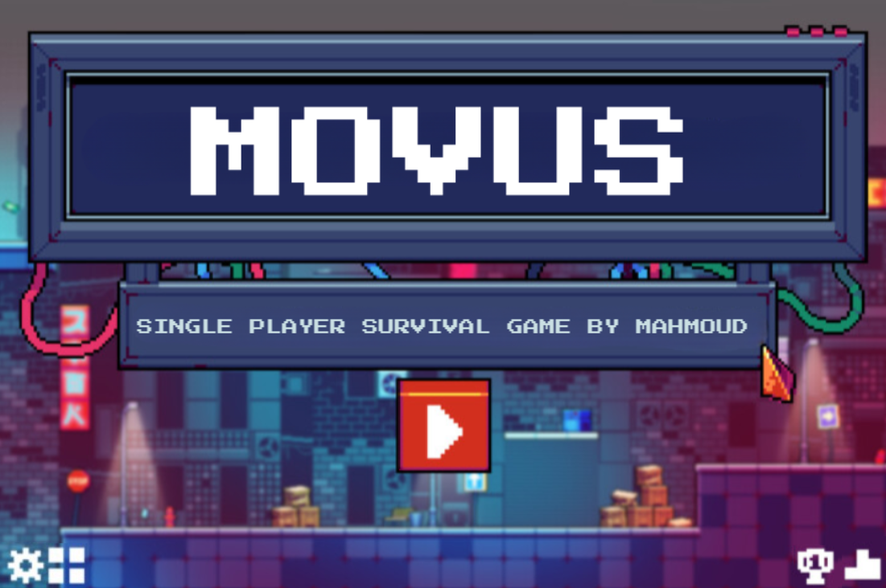
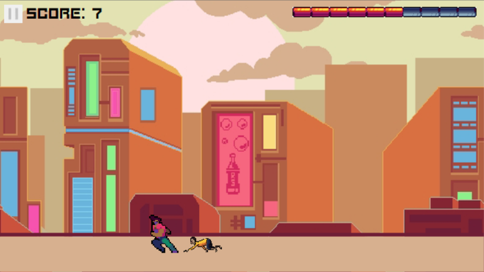
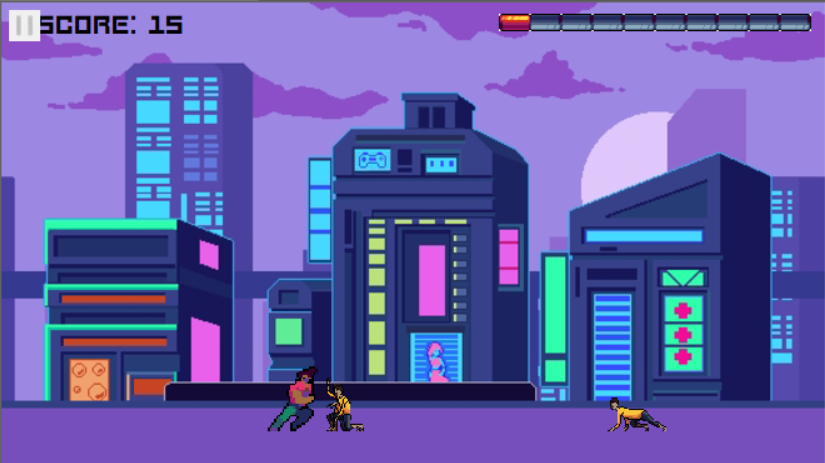
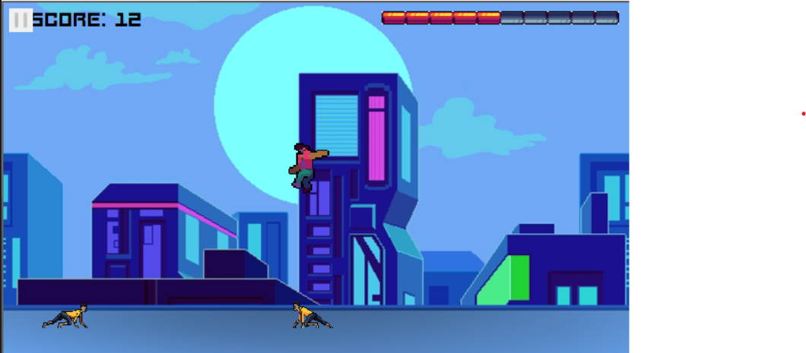
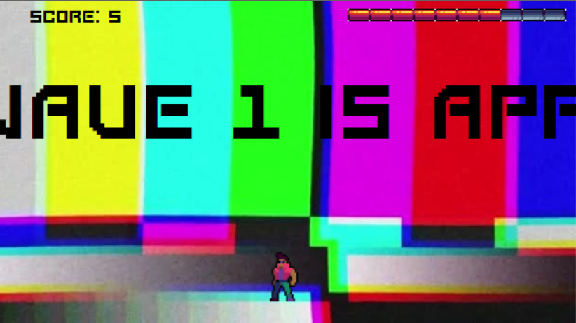
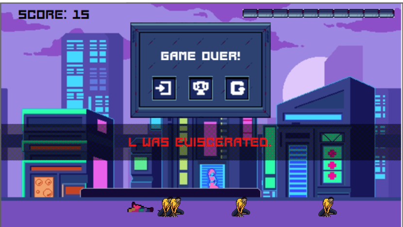
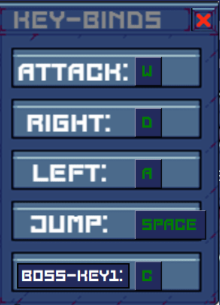
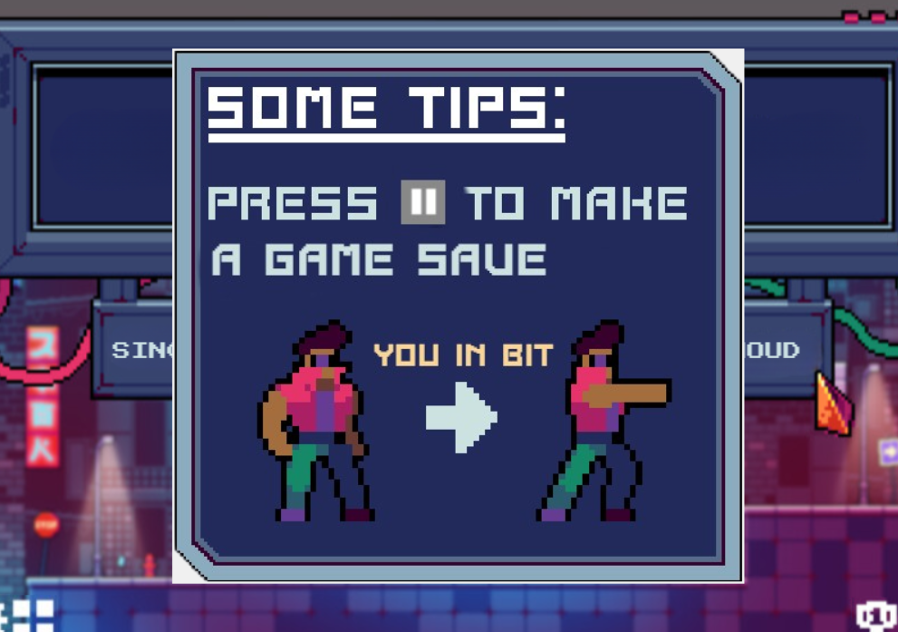

# MOVUS

**MOVUS** is a fast-paced, single-player survival game set in a pixel-art, cyberpunk world. Fight for your life, rack up a high score, and see how long you can survive the oncoming waves of enemies.

---

## 🕹️ About The Game

In MOVUS, you are thrown into a futuristic city and must defend yourself against waves of relentless enemies. The goal is simple: **survive**. The longer you last, the higher your score. Jump across buildings, take down foes, and manage your health to become the ultimate survivor.

---

## ✨ Features

* **Wave-Based Survival:** Face increasingly difficult waves of enemies.
* **Scoring System:** Earn points for every enemy you defeat and try to beat your high score.
* **Health Management:** Keep an eye on your health bar—take too much damage, and it's game over!
* **Pixel-Art Visuals:** A retro, cyberpunk aesthetic with multiple cityscape backgrounds.
* **Save System:** Pause the game at any time to save your progress and custom settings. Load them by using the same username.
* **Keybind Check:** Does not allow the user to enter invalid/duplicate keybinds in the settings and highlights errors in red.
* **Customizable Controls:** Re-bind your keys to fit your playstyle from the settings menu.
* **Leaderboard:** A dynamically changing board based on different players' scores.
* **Death Message:** Randomly generated from a pool of messages from the game Terraria.
* **Boss Key:** A built-in "Boss-Key" to quickly hide the game, with two options one for a transparent screen and the other for overlay of a .png of your choice in full screen(default is a screenshot of me developing the game in VS Code).

---

## ⌨️ How to Play

Use the default controls to navigate the world and fight enemies. You can change these in the **Key-Binds** menu.

* **Move Left:** `A`
* **Move Right:** `D`
* **Jump:** `SPACE`
* **Attack:** `W`
* **Pause:** `[PAUSE BUTTON ICON]` (Press to pause and save the game)
* **Boss Key:** `C`
* **Cheat Code:** `[KONAMI CODE]` (Regenerates health and increases jump height)

---

## 📸 Screenshots

Here are some glimpses of the action in MOVUS.

### Gameplay

### Jumping (with the cheat code activated)

### Wave Transition Screen (with the Type Writer effect/animation)

### Game Over

### Settings Screen

### Tip Screen

---

## 🛠️ Built With

* **[Language]** - Python(via Tkinter and PIL only)
* **[Tool]** - GIMP to edit copyright-free pixel art from [CraftPix][art-source]

[art-source]: https://craftpix.net/

